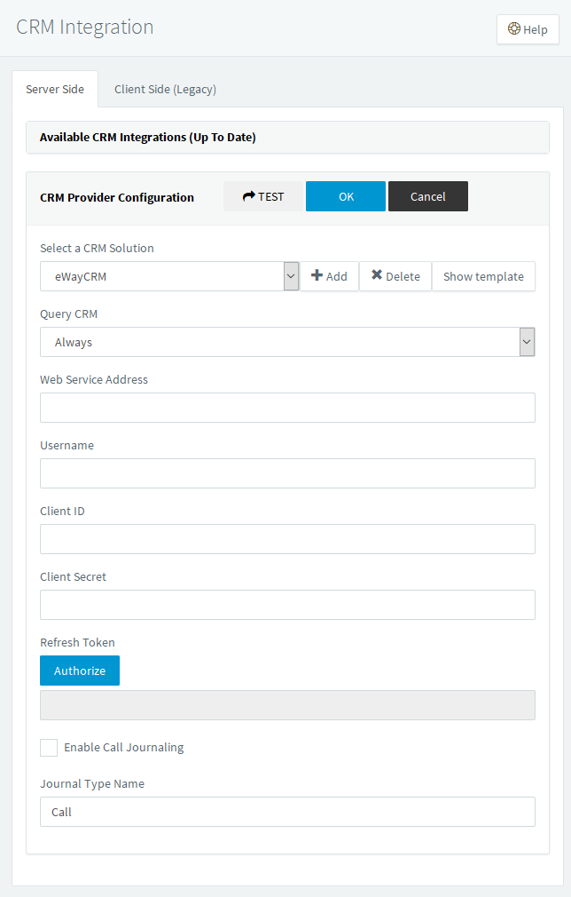
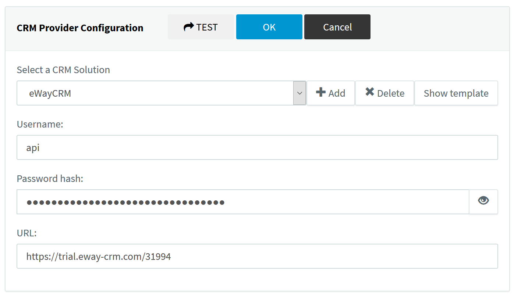

# 3CX
Template for [eWay-CRM](https://www.eway-crm.com/) server-side integration with 3CX.

## Installation of the Template (eWay-CRM 6.1 and newer)

Download [latest version](https://raw.githubusercontent.com/eway-crm/3CX/master/3CX_eWay-CRM_Template.xml) of the template.

Go to your 3CX Console > Settings > CRM Integration > Server side tab > and click Add to upload the eWay-CRM template to 3CX.

After the template is added fill in the Username of the eWay-CRM API user that has access to view Contacts / Companies / Deals.
Web Service Address is URL address of the eWay-CRM Web Service without the trailing slash.
Ask eWay-CRM support to provide you Client ID and Client Secret.
Click Authorize to get Refresh Token. You have to login as the user which is defined in the Username field.
You can also enable / disable automatic creation of the call journals in eWay-CRM.

## Installation of the Template (eWay-CRM 6.0 and older)

Download [version 2.0](https://github.com/eway-crm/3CX/releases/download/V2.0/3CX_eWay-CRM_Template.xml) of the template.

Go to your 3CX Console > Settings > CRM Integration > Server side tab > and click Add to upload the eWay-CRM template to 3CX.

After the template is added fill in the Username of the eWay-CRM API user that has access to view Contacts / Companies / Deals.
In the Password hash insert [MD5 encrypted password](https://www.eway-crm.com/md5/) of the user.
Web Service Address is URL address of the eWay-CRM Web Service.
You can also enable / disable automatic creation of the call journals in eWay-CRM.

