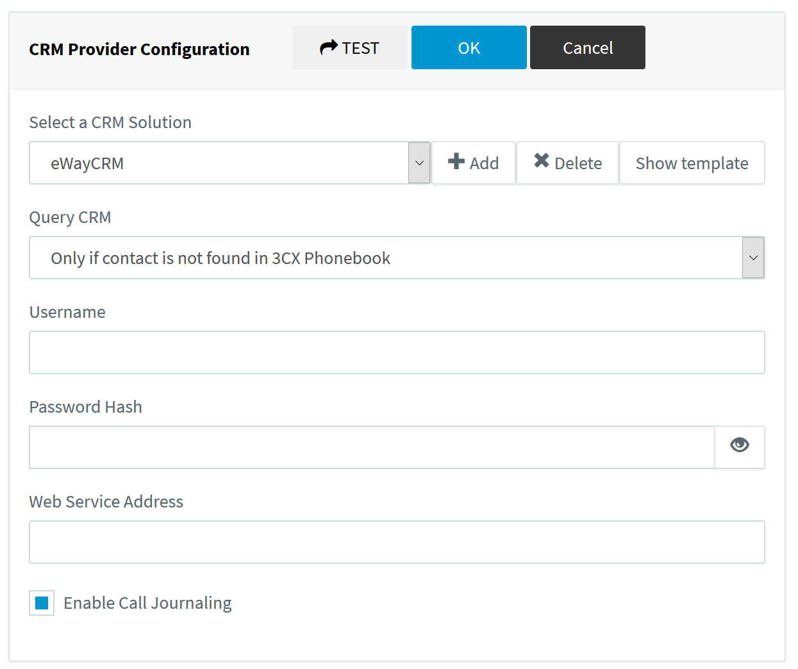

# 3CX
Template for [eWay-CRM](https://www.eway-crm.com/) server-side integration with 3CX.

## Installation of the Template

Download [latest version](https://raw.githubusercontent.com/eway-crm/3CX/master/3CX_eWay-CRM_Template.xml) of the template.

Go to your 3CX Console > Settings > CRM Integration > Server side tab > and click Add to upload the eWay-CRM template to 3CX.

After the template is added fill in the Username of the eWay-CRM API user that has access to view Contacts / Companies / Deals.
In the Password hash insert [MD5 encrypted password](https://www.eway-crm.com/md5/) of the user.
Web Service Address is URL address of the eWay-CRM Web Service.
You can also enable / disable automatic creation of the call journals in eWay-CRM.

